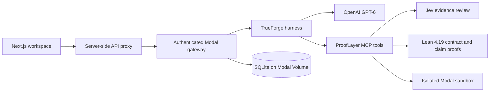

# ProofLayer Forge

**Research reproduction with an inspectable evidence logbook.**

[Live demo](https://prooflayer-forge.vercel.app/) · [Research workspace](https://prooflayer-forge.vercel.app/workspace) · [GitHub repository](https://github.com/perfect7613/prooflayer-forge)

ProofLayer Forge turns research-paper claims into bounded, reviewable investigations. A TrueForge agent reads the source, proposes a protocol, waits for human approval, writes or adapts the experiment, and runs it in an isolated Modal sandbox. Jev independently reviews the evidence claim by claim. The result is a report with source hashes, code, stdout, failures, sandbox IDs, Lean output, and explicit limitations.

The project is designed for an important distinction: a successful run is evidence about a defined experiment, not certification of an entire paper.

## What it does

1. Accepts an arXiv URL, approved OpenAI/Anthropic PDF URL, pasted paper text, or a commit-pinned repository file.
2. Extracts concrete claims and proposes a reproducible protocol.
3. Pauses at a TrueForge approval checkpoint before generated code runs.
4. Executes Python in a fresh, credential-free, network-blocked Modal sandbox.
5. Loads the official [Lean proof skill](https://github.com/leanprover/skills/tree/main/skills/lean-proof), runs a compulsory Lean 4.19 arithmetic contract, and can compile one standard-library statement per formal claim.
6. Routes each claim to Jev for an independent evidence assessment.
7. Produces a readable report and evidence-backed charts through TrueForge Generative UI.

## Live demo

The public workspace is shared. Anyone can inspect existing investigations, submit a source, approve a protocol, and start a bounded experiment. Provider keys remain in Modal and are never sent to the browser or generated-code sandbox.

The included demonstration reproduces a scoped Section 5.1 ridge-regression experiment from [To Grok Grokking: Provable Grokking in Ridge Regression](https://arxiv.org/html/2601.19791v1). It uses eight fixed seeds, four weight-decay settings, direct-gradient checks, a no-decay control, Jev review, and generated figures. The results are intentionally reported as a paper subset with supported and inconclusive claims. A second public investigation reads the OpenAI Navier–Stokes PDF: two formula checks are supported, and the blowup theorem is not established.

## Architecture



The Vercel deployment hosts the landing page, workspace, and server-side proxy. Modal hosts the TrueForge controller, MCP service, persistent evidence store, and isolated execution. SQLite runs in a single warm container with volume snapshots. The browser never receives `OPENAI_API_KEY`, `TYPESAFE_API_KEY`, gateway tokens, or MCP tokens.

TrueForge supplies model turns, tool dispatch, native approval pauses, event history, context compaction, and Generative UI. Generated experiment code runs through the bounded Modal execution tool rather than unrestricted native Code Mode. Daytona is not required.

## Safety boundaries

| Boundary | Enforcement |
| --- | --- |
| Human approval | `approve_protocol` is gated by TrueForge and bound to the protocol SHA-256 hash. |
| Protocol changes | Any changed protocol invalidates the grant; grants expire after one hour. |
| Python execution | New Modal sandbox, no application secrets, no mounted credentials, blocked network, 2 CPUs, 2 GiB RAM, 180-second deadline. |
| Execution budget | Six execution calls per investigation, including the required Lean check. |
| Lean requirement | Every live report is rejected unless a passed Lean contract evidence item exists. The contract is a fixed arithmetic sanity check. A separate claim proof can support only the Std statement that compiled. |
| Reporting | Claims must cite stored evidence IDs. A zero exit code alone never establishes scientific support. |
| External writes | No email, payments, repository writes, GitHub comments, or automatic publication tools. |

The Lean contract checks a fixed natural-number confusion-count inequality using a restricted proof choice. Before it runs, the harness loads the pinned `lean-proof` skill from [leanprover/skills](https://github.com/leanprover/skills/tree/main/skills/lean-proof), records its source commit and SHA-256, and requires the skill's diagnostic-first methodology. It is compulsory even when a paper has no formal claim so that every live investigation records a formal-tool health check. Its output and axiom report remain visible evidence; the system never presents it as proof of an arbitrary paper.

A second Lean tool, `check_claim_proof`, compiles one statement written with Lean's standard library. The statement and the proof are checked separately from the paper text. `sorry`, extra declarations, and axioms outside `propext`, `Classical.choice`, and `Quot.sound` fail the check. A pass is evidence for that statement. It does not carry over to the rest of the paper, and it cannot load the Mathlib development used by a large formalization.

## Local development

Requirements: Node.js 22.14+, pnpm 11.19+, Python 3.12, and `uv`.

```sh
git clone https://github.com/perfect7613/prooflayer-forge.git
cd prooflayer-forge
pnpm install --frozen-lockfile
cp .env.example .env
pnpm dev
```

Open [http://127.0.0.1:3000](http://127.0.0.1:3000). **Explore a key-free fixture** runs locally without OpenAI, Jev, Modal, Lean, or cloud credentials. It demonstrates the evidence interface using a deterministic F1 calculation.

For Python and Modal work:

```sh
uv sync --locked
```

## Configuration and deployment

Set provider credentials in `.env`:

```dotenv
OPENAI_API_KEY=...
TYPESAFE_API_KEY=...
OPENAI_MODEL=gpt-6-sol
TYPESAFE_MODEL=jev-1.13.0
```

Deploy the Modal backend first:

```sh
pnpm deploy:modal
```

The deployment creates private gateway and MCP tokens, stores secrets in Modal, configures TrueForge, and writes the backend URL to `.env`. No TrueForge API key is required. The default model is GPT-6 Sol with high reasoning effort; `gpt-6-luna` may be selected when lower cost is preferred.

Deploy the public frontend with the Vercel CLI:

```sh
vercel link --yes --project prooflayer-forge
pnpm deploy:web
```

Only `PROOFLAYER_API_URL` and `PROOFLAYER_ACCESS_TOKEN` are configured as server-only Vercel environment variables. The deployment script never uploads model-provider credentials.

Redeployments use Modal's recreate strategy and briefly interrupt the backend. Do not redeploy during an active experiment. This is a shared demonstration service, not a highly available production system; an abrupt container loss can discard activity that has not reached the latest volume snapshot.

## Evidence and reports

Reports retain:

- source text or URL provenance and hashes;
- generated or adapted code;
- every execution attempt, including failures and stderr;
- Modal sandbox IDs and resource bounds;
- pinned Lean proof-skill provenance, source, compiler output, and axiom output;
- Jev model ID, question version, input hash, probabilities, and decisions;
- the original report, re-review history, and current policy version.

The workspace's **Evidence** tab makes the execution chain inspectable. Expand the generated Python or Lean source item to see its exact source and SHA-256. Expand the paired execution item to see the `Code source` evidence ID, Modal sandbox ID, exit code, and duration. A Lean item also shows whether it is the fixed contract or a claim statement, plus the statement and axiom list when those were recorded. The execution record points back to the saved source item, so the demo can show that the code presented by the agent is the code submitted to the sandbox rather than an untracked narration.

Reports use the verdicts `supported`, `contested`, and `inconclusive`, with scope labels for `toy`, `saved_predictions`, `paper_subset`, and `full`. A supported claim is the check that was run, not a proof of the paper's main theorem. Jev confidence is not a calibrated probability that a paper is correct. An inconclusive verdict is never upgraded. A toy formula or sample stays supported when Jev also selects supports at confidence 0.3 or higher. A paper-level conclusion still needs agreement at confidence 0.8 or higher; a missing or conflicting review removes it.

Before `write_report`, the harness must load the bundled [humanizer skill](https://github.com/blader/humanizer/blob/main/SKILL.md). It is loaded progressively through the research MCP server and applied to prose only; measurements, equations, citations, failed attempts, scope, and uncertainty are preserved. The upstream MIT license is included at `server/skills/humanizer/LICENSE`.

The Figures tab renders TrueForge's native OpenUI output through a small read-only component library. Values come only from successful sandbox stdout JSON. The agent can choose layout and fields, but cannot inject measurements, execute JavaScript, access remote URLs, or trigger tools through a generated view. Coordinate transforms use [pmndrs/math](https://github.com/pmndrs/math).

## Scope and limitations

The current version supports arXiv HTML, PDFs hosted by approved OpenAI or Anthropic domains, pasted extracted text, and individual commit-pinned raw GitHub files. PDF URLs are downloaded with redirects disabled, capped at 25 MB, checked for PDF magic bytes, and converted to text before the agent sees them. Scanned PDFs without an extractable text layer should be pasted as extracted text instead. The service does not clone complete repositories, fetch arbitrary datasets, install paper-specific dependencies, train large models, or attach binary artifacts. Unsupported requirements are recorded as limitations instead of being simulated.

The included Lean check does not prove paper theorems. Numerical agreement with a theorem's inequalities does not establish the theorem. Generated code may still encode a faithful-looking but incorrect interpretation, so source inspection, negative controls, and the complete audit trail remain necessary.

## Verification commands

```sh
pnpm typecheck
pnpm test
pnpm build
uv run pytest -q
uv run python -m py_compile modal/app.py runtime/hosting.py runtime/jev.py
```

Optional live checks use the deployed gateway and consume provider or Modal resources:

```sh
pnpm check:live preflight
pnpm check:live start
pnpm check:live status
```

## Repository map

| Path | Responsibility |
| --- | --- |
| `src/components/workspace.tsx` | Investigation intake, approval, evidence, figures, and reports |
| `src/components/landing.tsx` | Public landing page |
| `server/harness.ts` | TrueForge sessions, turns, events, and approval decisions |
| `server/mcp.ts` | Source retrieval, Python/Lean execution, and report tools |
| `server/report.ts` | Evidence validation, Jev reconciliation, and report history |
| `server/policy.ts` | Source, authorization, protocol, and Lean restrictions |
| `runtime/jev.py` | Typed Jev requests and response provenance |
| `modal/app.py` | Hosted gateway, persistence, and sandbox orchestration |
| `examples/grokking/` | Independent numerical feasibility check |

The [TrueForge repository](https://github.com/truefoundry/trueforge) supplies the agent harness.
